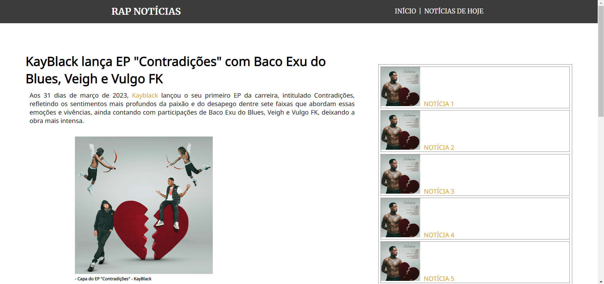

<h1 align="center"> Site de Noticias 🗞 </h1>
<h2> Sobre o Site 💻 </h2>

 Site "molde" de notícias que pode ser ajustado e configurado para falar sobre qualquer assunto. 
 

 Acesse este site clicando <a href="https://www.tiagoroglio.com.br/site-noticias" target="_blank"> aqui. </a>

<h2> Visualização do site 👁 </h2>

 Esta é a visualização do site, que pode ser vista ao acessá-lo. Foi criado como parte de um projeto de estudo e aprimoramento das habilidades em HTML e CSS durante a aula de INTRODUÇÃO ao desenvolvimento web. Como era uma matéria introdutória, meu conhecimento em desenvolvimento web ainda estava em estágio inicial. Vale ressaltar que este site não foi desenvolvido com um design responsivo. 

## Como Usar

Exemplos de uso vão aqui...

## Contribuição

Para contribuir, siga estas etapas...

## Licença

Este projeto é licenciado sob a [Nome da Licença](link para a licença).

## Contato

Para relatar problemas ou fazer perguntas, entre em contato via e-mail: [seu@email.com](mailto:seu@email.com).
